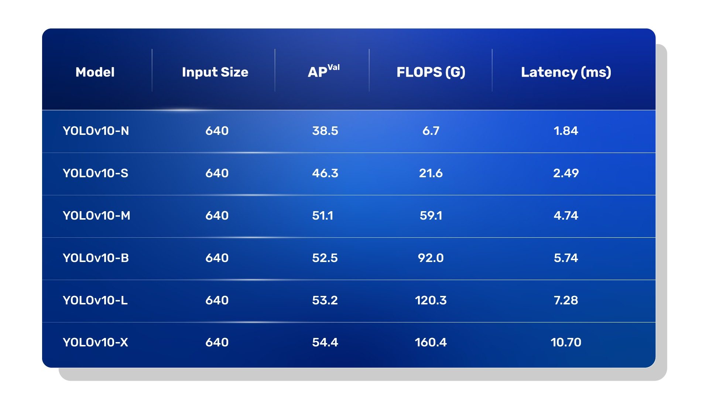

# YOLO V10  C++ TensorRT

  

## 🌐 Overview

The **YOLOv10 C++ TensorRT Project** is a high-performance object detection solution implemented in **C++** and optimized using **NVIDIA TensorRT**. This project leverages the YOLOv10 model to deliver fast and accurate object detection, utilizing TensorRT to maximize inference efficiency and performance. 

## 📢 Updates

### Key Features:

- **Model Conversion**: Convert ONNX models to TensorRT engine files to accelerate inference.
- **Inference on Videos**: Efficiently perform object detection on video files.
- **Inference on Images**: Execute object detection on individual image files.

By combining the advanced capabilities of YOLOv10 with TensorRT’s powerful optimization, this project provides a robust and scalable solution for real-time object detection tasks.

## 📑 Table of Contents

- [Project Structure](#project-structure)
- [Dependencies](#dependencies)
- [Installation](#installation)
- [Usage](#usage)
  - [Convert ONNX Model to TensorRT Engine](#convert-onnx-model-to-tensorrt-engine)
  - [Run Inference on Video](#run-inference-on-video)
  - [Run Inference on Image](#run-inference-on-image)
- [Configuration](#configuration)
- [Troubleshooting](#troubleshooting)

## 🏗️ Project Structure
YOLOv10-TensorRT/

│── include/

│ ├── YOLOv10.hpp

│── src/

│ ├── main.cpp

│ ├── YOLOv10.cpp

│── CMakeLists.txt

└── README.md
## 📦 Dependencies

- **OpenCV V4.10.0**: For image and video processing.
- **CUDA V11.7**: For GPU acceleration.
- **TensorRT V8.6.1.6**: For optimized inference with YOLOv10.
- **cuDNN V9.2.1**: For accelerating deep learning training and inference on NVIDIA GPUs. 

## 💾 Installation

### 1. Install Dependencies

- **OpenCV**: Follow the instructions on the [OpenCV official website](https://opencv.org/) to install OpenCV.
- **CUDA & cuDNN**: Install CUDA & cuDNN from the [NVIDIA website](https://developer.nvidia.com/cuda-toolkit).
- **TensorRT**: Download and install TensorRT from the [NVIDIA Developer website](https://developer.nvidia.com/tensorrt).

### 2. Clone the Repository

git clone [https://github.com/hamdiboukamcha/yolov10-tensorrt.git](https://github.com/hamdiboukamcha/yolov10-tensorrt.git)

cd yolov10-tensorrt/Yolov10-TensorRT

      mkdir build
      cd build
      cmake ..
      cmake --build .

## 🚀 Usage

### Convert ONNX Model to TensorRT Engine

To convert an ONNX model to a TensorRT engine file, use the following command:

    ./YOLOv10Project convert path_to_your_model.onnx path_to_your_engine.engine.
        
path_to_your_model.onnx: Path to the ONNX model file.

path_to_your_engine.engine: Path where the TensorRT engine file will be saved.

### Run Inference on Video
To run inference on a video, use the following command:

    ./YOLOv10Project infer_video path_to_your_video.mp4 path_to_your_engine.engine

path_to_your_video.mp4: Path to the input video file.

path_to_your_engine.engine: Path to the TensorRT engine file.

### Run Inference on Video
Run Inference on Image
To run inference on an image, use the following command:

    ./YOLOv10Project infer_image path_to_your_image.jpg path_to_your_engine.engine
    
path_to_your_image.jpg: Path to the input image file.

path_to_your_engine.engine: Path to the TensorRT engine file.

## ⚙️ Configuration

### CMake Configuration
In the CMakeLists.txt, update the paths for TensorRT and OpenCV if they are installed in non-default locations:

#### Set the path to TensorRT installation

    set(TENSORRT_PATH "path/to/TensorRT")  # Update this to the actual path
    
Ensure that the path points to the directory where TensorRT is installed.

### Troubleshooting
Cannot find nvinfer.lib: Ensure that TensorRT is correctly installed and that nvinfer.lib is in the specified path. Update CMakeLists.txt to include the correct path to TensorRT libraries.

Linker Errors: Verify that all dependencies (OpenCV, CUDA, TensorRT) are correctly installed and that their paths are correctly set in CMakeLists.txt.

Run-time Errors: Ensure that your system has the correct CUDA drivers and that TensorRT runtime libraries are accessible. Add TensorRT’s bin directory to your system PATH.

## 📞 Contact

For advanced inquiries, feel free to contact me on LinkedIn: 

## 📜 Citation

If you use this code in your research, please cite the repository as follows:

        @misc{boukamcha2024yolov10,
            author = {Hamdi Boukamcha},
            title = {Yolo-V10-cpp-TensorRT},
            year = {2024},
            publisher = {GitHub},
            howpublished = {\url{https://github.com/hamdiboukamcha/Yolo-V10-cpp-TensorRT}},
        }

